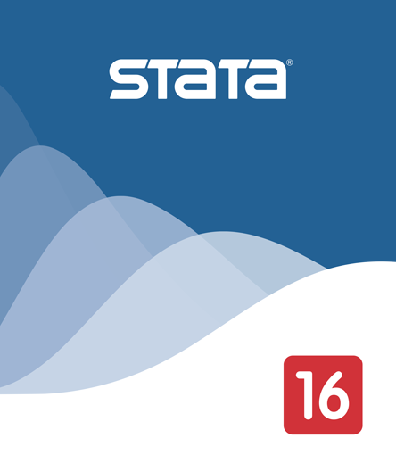
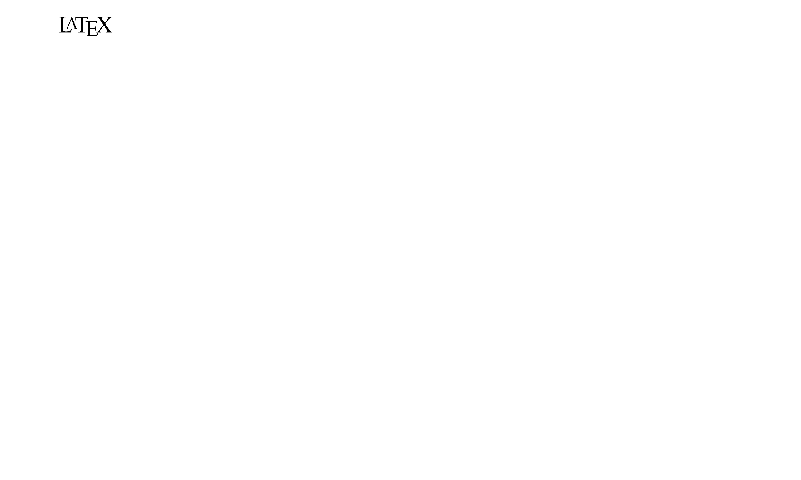

     <!--- Agrega lineas en blanco --->

<!------------- Panel de la izquierda ------------->

<!-- Foto completa -->

#### Danilo Esteban Aristizabal Giraldo
Economics, PhD student at Universidad de los Andes, interested in Labor Economics and Development.

<!-- Location -->
<a href="https://www.google.com/maps/place/Bogotá/@4.6486259,-74.2478944,11z/data=!3m1!4b1!4m5!3m4!1s0x8e3f9bfd2da6cb29:0x239d635520a33914!8m2!3d4.7109886!4d-74.072092" style="color:black;">   Bogotá, Colombia.</a>

<!-- Correo -->

 de.aristizabal411@uniandes.edu.co </img>

<!-- Correo -->

 daniloaristizabal@gmail.com </img>

<!-- Twitter -->
 <a href="https://twitter.com/dearistizabalg" style="color:black;">   @dearistizabalg</a> 

<!-- GitHub -->
<a href="https://github.com/danilo-aristizabal" style="color:black;">   danilo-aristizabal</a>

<!------------- Fin panel de la izquierda ------------->

<!------------- Panel de la derecha ------------->

     <!--- Agrega lineas en blanco --->

### About me

I’m a PhD student in Economics at Universidad de los Andes. 

### Research interests 
Labor Economics, Applied econometrics and Development.

### Experience

* #### Teaching

  + 
<strong style="color:black;font-size:16px;"> TA: </strong>  2023. Labor Economics (Undergrad), Universidad de los Andes. 

  + 
<strong style="color:black;font-size:16px;"> TA: </strong>  2019 - 2022. Econometrics (PhD), Universidad de los Andes. 

  
  + 
<strong style="color:black;font-size:16px;"> TA: </strong>  2022. Econometrics I (Undergrad), Universidad de los Andes. 

  
  + 
<strong style="color:black;font-size:16px;"> TA: </strong>  2022. Econometrics II (Undergrad), Universidad de los Andes. 

  
  + 
<strong style="color:black;font-size:16px;"> TA: </strong>  2020. Macroeconomics (Undergrad), Universidad de los Andes. 

  
  + 
<strong style="color:black;font-size:16px;"> TA: </strong>  2019. Macroeconomics (PhD), Universidad de los Andes. 

 
  + 
<strong style="color:black;font-size:16px;"> TA: </strong>  2017. International Trade (Undergrad, English), Universidad Carlos III de Madrid. 

* #### Research

  + 
<strong style="color:black;font-size:16px;"> Research Analyist: </strong>  World Bank. Social Protection and Labor Global. 2022-2023, currently. 

  
  + 
<strong style="color:black;font-size:16px;"> Research Assistant: </strong>  Republic Bank of Colombia. 2022. 

  
  + 
<strong style="color:black;font-size:16px;"> Research Assistant: </strong>  COVIDA Project - Universidad de los Andes. 2020 - 2021. 

  
  + 
<strong style="color:black;font-size:16px;"> Research Analyst: </strong>  Telefonica - Universidad de los Andes. 2019 - 2020. 

  
  

### Skills

  

 
 <!--- Logo R --->
 

   

   <h6 align=left style="color:black;"> &#160; &#160; &#160; &#160; Advanced </h6>
 

 
 <!--- Logo Stata --->
 

   

   <h6 align=left style="color:black;"> &#160; &#160; &#160; &#160; Advanced </h6>
 

  <!--- Logo LaTeX --->
 

   

   <h6 align=left style="color:black;"> &#160; &#160; &#160; Advanced </h6>
 

 

### Contact info

<!-- Correo -->
<a href="de.aristizabal411@uniandes.edu.co" style="color:black;">   de.aristizabal411@uniandes.edu.co</a>

<!-- Location -->
<a href="https://www.google.com/maps/place/Universidad+de+los+Andes/@4.6014634,-74.0683221,17z/data=!3m1!4b1!4m5!3m4!1s0x8e3f99a4a124b335:0x8e9f4683d1db9cb!8m2!3d4.6014581!4d-74.0661334" style="color:black;">   Department of Economics, Universidad de los Andes, Bogotá, Colombia.</a>

<!-- Tel -->
 (+571) 3394949 Ext: 2430 </img>

 <!--- FIn del panel de la derecha --->

